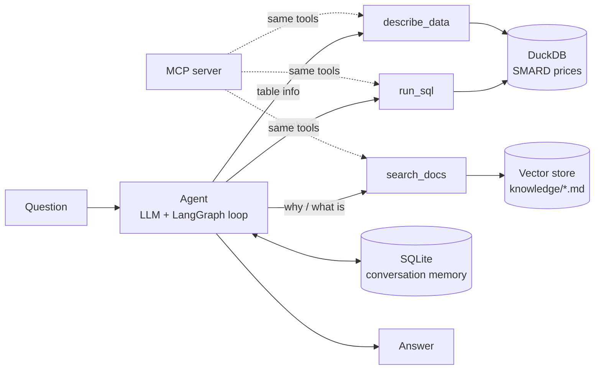

# Energy-market analyst agent

A tool-calling LLM agent that answers questions about German electricity prices (SMARD data from the
Bundesnetzagentur). It never guesses numbers: it inspects the data, writes SQL and answers from the
result. For "why" questions it retrieves explanations from a small knowledge base (RAG).

> Example: *"How many hours had negative prices last quarter, and why does that happen?"*
> → `describe_data` → `run_sql` → `search_docs` → answer with the number and the source document.

**Stack:** Python · LangChain / LangGraph · DuckDB · RAG (embeddings + vector store) · SQLite checkpointing ·
MCP · FastAPI · Docker · pytest · GitHub Actions

## Concepts in this project

| Concept | What it does here | Where |
|---|---|---|
| Tool-calling agent | LLM decides which tool to call, reads the result, repeats until it can answer | `src/energy_agent/agent.py` |
| Tools | `describe_data`, `run_sql` (read-only SQL on DuckDB), `search_docs` | `src/energy_agent/tools.py` |
| RAG | Markdown notes → chunks → embeddings → vector store → top-3 chunks per question | `src/energy_agent/rag.py`, `knowledge/` |
| Memory / long-running agent | LangGraph checkpointer saves each conversation to SQLite; reuse a `thread_id` to continue after a restart | `agent.py`, `cli.py --thread` |
| Guardrails | Read-only SQL, max 50 rows to the model, max 12 agent steps, "never invent numbers" prompt | `tools.py`, `config.py` |
| MCP server | Same tools exposed over the Model Context Protocol for any MCP client | `src/energy_agent/mcp_server.py` |
| MCP client | Agent discovers its tools through MCP instead of importing them | `src/energy_agent/mcp_client.py` |
| Evaluation | Questions with expected answers, graded automatically | `evals/` |
| Serving | FastAPI endpoint `/ask` | `src/energy_agent/api.py` |
| Deployment | Dockerfile + AWS App Runner guide | `Dockerfile`, `docs/DEPLOY_AWS.md` |
| Testing / CI | Offline tests (fake embeddings, no API key), run on every push | `tests/`, `.github/workflows/` |

## How it works



## Run it on your laptop

```bash
uv sync                              # creates .venv and installs everything
cp .env.example .env                 # add your API key
# download data → see data/README.md
uv run pytest                        # offline tests, no key needed

uv run energy-agent "Which month had the highest average price?"
uv run energy-agent --thread q3                          # chat; run again later with --thread q3 to continue
uv run energy-agent-mcp                                  # start the MCP server
uv run python -m energy_agent.mcp_client "How many hours had negative prices?"
uv run uvicorn energy_agent.api:app --reload             # API → http://127.0.0.1:8000/docs
uv run python evals/run_evals.py                         # grade the agent
uv run jupyter lab                                       # notebooks
```

## Read the code in this order

1. `notebooks/01_explore_data.ipynb` — the data and SQL, no AI
2. `data.py` → `tools.py` → `rag.py` — the building blocks
3. `agent.py` — how the loop, prompt and memory come together
4. `cli.py`, `api.py` — two ways to use the agent
5. `mcp_server.py`, `mcp_client.py` — the same tools through a standard protocol
6. `evals/run_evals.py` — how good is it really?

## Project structure

```
energy-agent/
├── pyproject.toml          dependencies + commands
├── .env.example            template for secrets (.env is never committed)
├── Dockerfile              container for the API
├── data/                   raw data (not committed) + conversation memory
├── knowledge/              documents for RAG
├── notebooks/              exploration and demos
├── src/energy_agent/       the application
├── evals/                  evaluation questions, runner, results
├── tests/                  offline tests
└── docs/                   deployment guide
```

## Evaluation results

<!-- Fill in after running evals/run_evals.py -->
| Model | Graded questions | Passed | Notes |
|---|---|---|---|
| | | | |

## What I learned

<!-- 3–5 honest lines: where the agent failed, what you changed, what surprised you -->

## Limitations and next steps

- Knowledge base is three short notes I wrote; a real system would index official documentation.
- Not yet implemented: human approval before sensitive tool calls, agent-to-agent communication (A2A),
  streaming agent events to a UI (AG-UI), cloud deployment beyond the Docker/App Runner template.
